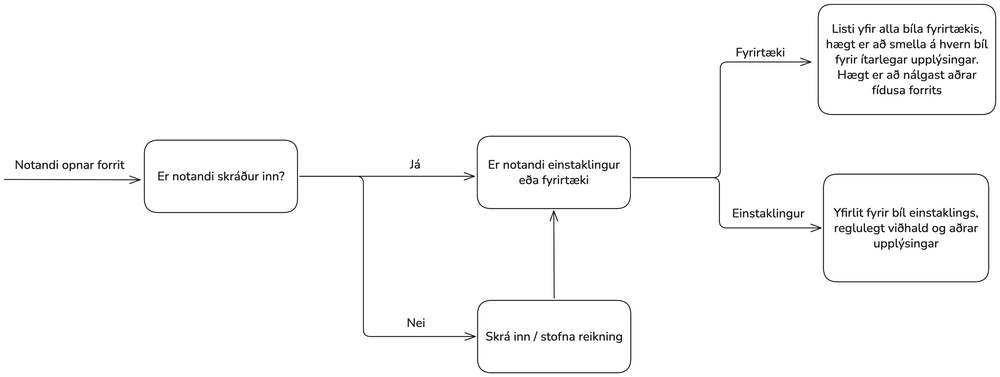

# Áætlun fyrir kröfugreiningarfund

## Markmið
- Lýsa helstu markmiðum kröfusöfnunar fyrir verkefnið sem á að greina 

## Áætlaður staður og stund fyrir fundinn 
Fundurinn haldinn kl 12:00 föstudaginn 17. október í Öskju

## Þátttakendur og hlutverk
- Leiðbeinandi: Egill
- Ritari: Valur
- Viðskiptavinir/hagsmunaaðilar: Gabríel og Ýmir eigendur Carma sem vilja kaupa hubúnaðinn

## Aðferð kröfusöfnunar

- Hvað er aðalvandamálið sem þið viljið leysa?

- Hvaða virkni á að leggja mesta áherslu á?

- Hvernig fá notendur aðgang að þjónustunni?

- Hvernig er notkun einstaklinga og fyrirtækja ólík?

- Hvernig mun verið gengið úr skugga um að aðeins eigendur bíls fái upplýsingar um hann?

- Hvernig finnur maður upplýsingar um verkstæði?

- Geta notendur notað þjónusta án þessa að skrá sig inn?

- Hvað græða notendurnir á því að nota þjónustuna?

- Hvar verða gögn geymd og hversu miklar upplýsingar skla geyma?

- Hvernig mun Carma græða pening?

- Hverjar eru helstu áhættur í rekstrinum?

## Líkön til að kveikja umræðu, skjöl og kerfi 
Flowchart fyrir einfalt almennt notkunartilvik

## Dagskrá/Tímalína
- 13:00–13:10 Kynning
- 
- 13:10-13:20 Umræða kringum líkan
-
- 13:20-13:50 Viðtal fyrir kröfusöfnun
- 
- 13:50–14:00 Samræming í lok viðtals

## Áætlaðar afurðir sem koma út úr kröfusöfnuninni 
- Skýrar hugmyndir um hvernig virkni forritstins á að fara fram, hvernig notendaupplifun á að vera 
- Upplýsingar sem hægt er að búa til vandaðar kröfur úr
- Skýrt hvaða utanaðkomandi þjónustur þarf að eiga í samskiptum við við notkun forritsins.

## Áhætta sem getur hindrað kröfusöfnun 
- Of skammur tími fyrir viðtal
- Mögulegur misskilningur milli kröfusafnara og viðskiptavina (reynt er að komast hjá þessu með samræmingu í lok viðtals)
